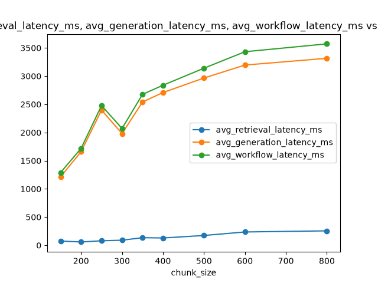
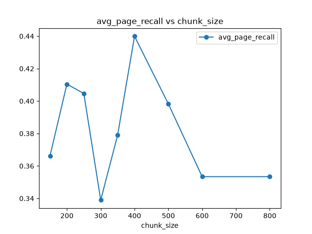

# Self-Reflective RAG for Autonomous Information Retrieval


A production-inspired Retrieval-Augmented Generation (RAG) system for document question answering using Hybrid Retrieval, Cross-Encoder Re-ranking, and a LangGraph-based self-reflective workflow.

A self-reflective Retrieval-Augmented Generation pipeline (LangGraph +
Chroma + Ollama), built in phases with production-style engineering
practices: persistent vector indexing, incremental ingestion, an
interface-based retrieval layer, and centralized configuration.

## Architecture

```
                     Offline Ingestion Pipeline

           PDF Documents
                 │
                 ▼
         PDF Loader (PyMuPDF)
                 │
                 ▼
      Recursive Text Chunking
                 │
                 ▼
     HuggingFace Embeddings
                 │
                 ▼
      Persistent ChromaDB Index
       (incremental, SHA-256
        duplicate detection)


                  Online Query Pipeline

          User Question
                 │
                 ▼
      Hybrid Retrieval
   (Semantic + BM25 + RRF)
                 │
                 ▼
   Cross-Encoder Re-ranking
        (optional)
                 │
                 ▼
      LangGraph Workflow
  (Retrieve → Grade → Rewrite
     → Generate → Verify)
                 │
                 ▼
      Answer + Source Citations
                 │
                 ▼
   Evaluation / Debug Dashboard
```

## Features

- Local Llama 3.2 inference via Ollama -- fully offline, no API key
- HuggingFace embeddings (`BAAI/bge-small-en-v1.5`)
- Persistent ChromaDB indexing, separated from inference (`ingest.py` vs. `app.py`)
- Incremental ingestion -- only new/changed files get (re-)embedded
- Duplicate detection via SHA-256 content hashing (`data/manifest.json`)
- Hybrid Retrieval (Semantic + BM25)
- Reciprocal Rank Fusion (RRF)
- Optional Cross-Encoder Re-ranking
- Metadata-aware retrieval (page, section, filename)
- LangGraph self-reflective workflow (grade → rewrite → regenerate, with bounded retries)
- Source citations (page + filename, no PDF re-parsing needed)
- Retrieval Debug Dashboard (per-stage scores, latency, full chunk text)
- Deterministic Evaluation Dashboard (latency, page recall, retries -- no LLM judge)
- Benchmarking framework (chunk size / embedding model sweeps)

## Screenshots

**RAG Q&A** -- ask a question, get an answer with source citations:


**Retrieval Debug Dashboard** -- trace exactly why a chunk was retrieved
(semantic / BM25 / RRF / re-rank scores), plus the full chunk text:


**Evaluation Dashboard** -- deterministic metrics (latency, page recall,
retries, low-confidence rate) with no LLM judge involved:


## Project Structure

```
.
├── app.py
├── benchmark.py
├── evaluate.py
├── ingest.py
├── config.py
│
├── src/
│   ├── ingestion/
│   ├── indexing/
│   ├── retrieval/
│   ├── workflow/
│   ├── evaluation/
│   └── utils/
│
├── pages/
│   ├── Retrieval_Debug_Dashboard.py
│   └── Evaluation_Dashboard.py
│
├── data/
│   ├── raw/
│   └── eval/
│
├── results/
│   ├── chunk_size_benchmark.csv
│   ├── evaluation_results.csv
│   ├── evaluation_summary.json
│   └── plots/
│
├── docs/
│   ├── RAG_Interview_Handbook.pdf
│   ├── Benchmark_Report.pdf
│   └── System_Architecture.pdf
│
└── tests/
```
# Benchmark Results

The retrieval pipeline was benchmarked across **9 different chunk sizes** while keeping the retrieval strategy, embedding model, LLM, and evaluation dataset fixed.

### Chunk Size Benchmark

| Chunk Size | Chunks | Retrieval (ms) | Workflow (ms) | Avg Page Recall |
|------------|---------|---------------|--------------|----------------|
|150|229|75.3|1290|0.366|
|200|161|58.9|1717|0.410|
|250|129|79.7|2478|0.405|
|300|107|90.3|2072|0.339|
|350|96|134.5|2676|0.379|
|**400**|**90**|**129.5**|**2839**|**0.440**|
|500|71|173.9|3140|0.398|
|600|55|236.2|3432|0.353|
|800|49|256.0|3572|0.353|

## Production Evaluation

The final pipeline was evaluated on **51 manually curated questions**.

| Metric | Result |
|---------|--------|
|Questions Evaluated|51|
|Average Retrieval Latency|125 ms|
|Average Generation Latency|9.69 s|
|Average Workflow Latency|9.82 s|
|Average Page Recall|0.4075|
|Retry Rate|43.14%|
|Query Rewrite Rate|27.45%|
|Low Confidence Rate|35.29%|
|Average Citations per Answer|2.04|

## Benchmark Plots

### Retrieval Latency



### Page Recall



## Setup

```bash
pip install -r requirements.txt
python ingest.py        # builds the vector store from every PDF in data/raw/
streamlit run app.py    # or: python main.py
```

Add PDFs any time by dropping them into `data/raw/` and re-running
`python ingest.py` -- already-indexed files (tracked by SHA-256 content
hash in `data/manifest.json`) are skipped automatically, so only new or
changed files get (re-)embedded.

## Add Your Documents

Bring your own PDF(s) and place them here:

```
data/raw/
```

The expected layout looks like:

```
data/
├── raw/
│   └── your_document.pdf
├── eval/
└── vectorstore/   (generated automatically)
```

Once your PDF(s) are in place, build the vector database:

```bash
python ingest.py
```

`ingest.py` only embeds documents that are new or have changed since the
last run. Duplicate detection is based on a SHA-256 hash of each file's
content, tracked in `data/manifest.json`, so re-running it after adding
a single new PDF re-embeds only that file rather than the whole corpus.

Then start the application:

```bash
streamlit run app.py
```

`data/vectorstore/` (the Chroma index) and `data/manifest.json` are both
generated automatically by `ingest.py` and are intentionally excluded
from Git -- they're derived, machine-specific artifacts, not source.

## Retrieval architecture (PHASE 1 + PHASE 2)

Every retriever implements a single interface, `BaseRetriever.retrieve(query, k=None)`
(`src/retrieval/base.py`), so the LangGraph workflow (`src/workflow/`) never
needs to know which retrieval strategy is active.

```
SemanticRetriever  ──┐
 (Chroma / cosine)   ├──▶ HybridRetriever ──▶ [CrossEncoderReranker] ──▶ workflow
BM25Retriever ────────┘   (Reciprocal Rank      (optional)
 (lexical / keyword)         Fusion)
```

`src/retrieval/retriever.py` is the single factory (`get_retriever`) that
composes this pipeline based on `config.py`:

| Config field                 | Env var                     | Default | Effect |
|-------------------------------|------------------------------|---------|--------|
| `use_hybrid_retrieval`         | `RAG_USE_HYBRID_RETRIEVAL`   | `true`  | Combine semantic + BM25 via RRF instead of semantic-only |
| `hybrid_candidate_k`           | `RAG_HYBRID_CANDIDATE_K`     | `10`    | Candidates each of semantic/BM25 fetch before fusion |
| `rrf_k`                        | `RAG_RRF_K`                  | `60`    | RRF constant: `1 / (rrf_k + rank)` |
| `use_reranking`                | `RAG_USE_RERANKING`          | `false` | Add a cross-encoder re-ranking stage (optional, off by default) |
| `reranker_model`               | `RAG_RERANKER_MODEL`         | `cross-encoder/ms-marco-MiniLM-L-6-v2` | Cross-encoder model |
| `rerank_candidate_k`           | `RAG_RERANK_CANDIDATE_K`     | `20`    | Candidates pulled before re-ranking |
| `rerank_k`                     | `RAG_RERANK_K`               | `5`     | Final results returned after re-ranking |
| `retrieval_k`                  | `RAG_RETRIEVAL_K`            | `4`     | Final results returned when re-ranking is off |


## Metadata-aware retrieval

Every chunk, from every retriever, carries the same metadata attached
during ingestion (`src/ingestion/chunking.py`):

```
document_id   SHA-256 hash of the source file (stable across re-ingests)
source        Human-readable source label (the filename)
filename      Original filename
page          1-indexed PDF page number
section       Best-effort heading detected on that page (heuristic; may be None)
chunk_id      Running counter, unique within the document
created_at    ISO timestamp of ingestion
```

This is what makes PHASE 3 (source citations, e.g. "Page 12, input.pdf")
a metadata lookup rather than a re-parse of the original PDF.


## Evaluation

```
src/evaluation/
    dataset_loader.py   loads + validates data/eval/questions.json
    evaluator.py         runs each question through the real retriever + compiled workflow
    metrics.py           computes page recall, builds the results table + summary
evaluate.py               CLI entry point
pages/2_Evaluation_Dashboard.py   optional Streamlit dashboard over the results
```

### 1. Create an evaluation dataset

Edit `data/eval/questions.json` -- a JSON list of question objects:

```json
[
  {
    "question": "What is the requirement for a Bachelor in Business Administration?",
    "ground_truth": null,
    "expected_pages": [8]
  }
]
```

- `question` -- required.
- `ground_truth` -- optional reference answer. Kept for schema
  compatibility and possible future use, but no metric in this
  framework currently consumes it (there's no LLM judge to compare
  against).
- `expected_pages` -- optional list of 1-indexed PDF page numbers the
  answer is expected to come from. Powers the deterministic **Page
  Recall** metric (see below).

### 2. Run it

```bash
python ingest.py                            # if you haven't already
python evaluate.py --questions data/eval/questions.json --out results/evaluation_results.csv
```

Runs entirely offline against the project's own local Ollama LLM and
HuggingFace embedding model -- no external API calls, no judge model,
no network dependency of any kind beyond what ingestion/generation
already need.

### 3. Sample output

```
----------------------------------------
Question 49: What are all the situations in which a student's result may be kept on hold?
  Retrieval Latency   103.6 ms
  Generation Latency  17079.9 ms
  Workflow Latency    17183.6 ms
  Retrieved Chunks    4 (4 reranked)
  Page Recall         0.000
  Retries             6 (query rewritten: True)
  Low Confidence      True
  Citations           1
----------------------------------------
Question 50: Explain the complete passing criteria, including grace marks and plagiarism cases.
  Retrieval Latency   124.7 ms
  Generation Latency  6533.8 ms
  Workflow Latency    6658.5 ms
  Retrieved Chunks    4 (4 reranked)
  Page Recall         0.667
  Retries             0 (query rewritten: False)
  Low Confidence      False
  Citations           2

Per-question results : results/evaluation_results.csv
Summary               : results/evaluation_summary.json
```

`results/evaluation_results.csv` has one row per question: Question,
Answer, Retrieved Pages, Expected Pages, Page Recall, Retrieved Chunks,
Chunks After Reranking, Retrieval/Generation/Workflow Latency, Answer
Length, Retries, Low Confidence, Query Rewritten, Sources.
`results/evaluation_summary.json` has the averaged metrics plus a run
manifest (timestamp, question count, LLM/embedding/retrieval config
used) -- useful for comparing runs after a retrieval or prompt change.


### Optional: Streamlit dashboard

```bash
streamlit run app.py
```

Then open the **Evaluation Dashboard** page from the sidebar nav -- it
can either load the latest `results/evaluation_results.csv` /
`evaluation_summary.json`, or run evaluation live from the browser
(same underlying call as `python evaluate.py`). Shows metric cards
(average latencies, page recall, retry/low-confidence rates), latency/
page-recall/chunk-count charts, and the per-question table.

## Benchmarking (chunk size / embedding model sweeps)

```bash
python benchmark.py --chunk-sizes 200 400 800
python benchmark.py --embedding-models BAAI/bge-small-en-v1.5 intfloat/e5-base-v2
```

For each configuration, ingests into an isolated, throwaway Chroma
collection (your real `data/vectorstore/` is never touched), then
measures ingestion time, retrieval latency, generation latency, and
page recall (against `expected_pages` in the eval set) -- all
deterministic, no judge LLM involved. Results go to
`results/chunk_size_benchmark.csv` / `results/embedding_model_benchmark.csv`,
with comparison plots under `results/plots/` (skipped gracefully if
`matplotlib` isn't installed). Runs completely offline.

## Dependency notes (why these versions)

`requirements.txt` lists **direct dependencies only** -- transitive packages
(numpy, requests, huggingface_hub, torch's `nvidia-*` CUDA packages, etc.)
are intentionally left unpinned; pip resolves those automatically, and
pinning them adds maintenance burden without benefit.

| Package | Bound | Why |
|---|---|---|
| `langchain` / `langchain-community` | `==0.3.9` / `==0.3.8` exact | Released together; mismatched patch lines between them are a common source of subtle breakage. Kept exactly as the project was already built against. |
| `langchain-core`, `-text-splitters`, `-huggingface`, `-ollama` | floated within the `0.3.x` line compatible with the pins above | Each integration package tracks `langchain-core`'s interfaces; floating within the same minor line picks up patch fixes without risking the next breaking minor release. |
| `langgraph` | `>=0.2.53,<0.3` | Matches the `langchain-core 0.3.x` generation; `langgraph 0.3`+ tracks `langchain-core 0.4`/`1.x`, which isn't what's pinned here. |
| `chromadb` | `>=0.5.20,<0.6` | Contemporary with `langchain-community==0.3.8`'s `Chroma` wrapper; verified to resolve and import cleanly together. |
| `torch` / `transformers` / `sentence-transformers` | `2.5.x` / `4.46.x` / `3.3–3.x` | Mutually compatible generation that supports `CrossEncoder` (re-ranking) and `HuggingFaceEmbeddings` without requiring a CUDA toolkit newer than what's commonly available. |
| `pydantic` | `>=2.0,<3` | Used directly for the grading/routing schemas (`BaseModel`, `Field`) in `src/workflow/prompts.py`; `langchain-core 0.3.x` also requires Pydantic v2. |

**Removed:** `python-dotenv` was in the old (170+ line, `pip freeze`-style)
requirements file but isn't actually imported anywhere in the codebase --
`config.py` reads `os.environ` directly. Dropped as dead weight; add it
back (`pip install python-dotenv` + a `load_dotenv()` call at the top of
`config.py`) if you'd like `.env` file support. `ragas` and `datasets`
were removed entirely in a later revision -- see "Why deterministic over
LLM-judged" in the Evaluation section above.

**Also available:** `pyproject.toml` mirrors the same pinned dependencies
in the modern `[project.dependencies]` format, with `pytest` split into an
optional `dev` extra (`pip install -e ".[dev]"`). `requirements.txt` still
includes `pytest` directly so `pip install -r requirements.txt && pytest`
works standalone, per the deliverable checklist.

## Testing

```bash
pytest tests/ -q
```

Covers: file hashing, manifest/duplicate-detection, page-aware chunking,
config parsing, vector store load/create logic, all PHASE 2 retrieval
components (BM25, RRF fusion, cross-encoder re-ranking, retrieval
diagnostics, and the retriever factory's branching logic), source
citation formatting, and the deterministic evaluation/benchmark
modules (page recall, results-table building, summary averaging,
CSV writing, plotting, question-set loading) -- using lightweight
fakes throughout, so the suite needs no embedding model, live
Chroma/cross-encoder download, or Ollama instance to run.

## Roadmap

- ✅ PHASE 1 -- ingestion, persistent indexing, retriever abstraction, config
- ✅ PHASE 2 -- hybrid retrieval (BM25 + semantic via RRF), metadata-aware retrieval, optional cross-encoder re-ranking
- ✅ PHASE 3 -- source citations (page + filename), using the metadata already in place
- ✅ PHASE 4 -- retrieval debug dashboard (per-stage scores, latency, full chunk text)
- ✅ PHASE 5 -- deterministic evaluation (latency, chunk counts, page recall, retries -- no LLM judge)
- ✅ PHASE 6 -- benchmarking harness (chunk size / embedding model sweeps, CSV + plots)

What's intentionally *not* built (low ROI for this project's scope):
BM25 index persistence (fine at this corpus size), a `ChunkMetadata`
model in place of dicts, per-request latency breakdown beyond what the
debug dashboard already shows, agentic/graph RAG, fine-tuning, or a
custom vector DB / distributed deployment.

## License

This project is licensed under the MIT License. See the `LICENSE` file for details.
